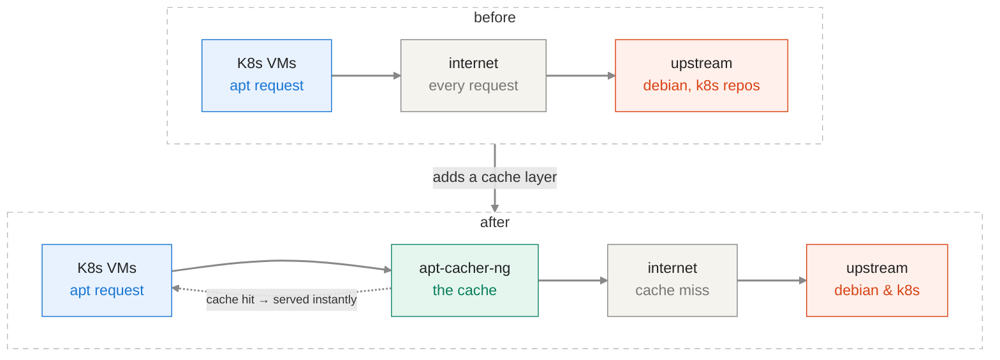

## HomeLab-Platform
To review and enhance my SRE skills in the context of Kubernetes clusters.

### APT Cacher
- Motivation

In a homelab, node provisioning and cluster rebuilds happen frequently — testing upgrades, validating Terraform/Ansible changes, or running disaster-recovery drills. Each rebuild re-fetches the same OS and k8s packages from upstream repositories, increasing external dependency and network egress costs.

**`apt-cacher-ng` is deployed as a pull-through caching proxy** on the hypervisor, sitting between internal VMs and upstream package repositories — the same pattern used by enterprise artifact proxies (Artifactory, Nexus) applied at hypervisor scale.

- Goals

 1. **Reduced blast radius of upstream issues** 
 2. **Improve resilience to upstream/network outages**
 3. **Lower external bandwidth / egress**
 4. **Faster provisioning / lower MTTR**
 5. **Lower operational toil**

- Architecture

- Steps

 1. Install `apt-cacher-ng` on hypervisor (I tested 3.7.5);
 2. Modifying apt-cacher-ng configuration `acng.conf`:
	- Allow https requests for repos without http `AllowUserPorts: 80 443` .
	- Publish just on the overlay network `BindAddress: 192.168.122.1` . `192.168.122.1` is IP of the virtual bridge on hypervisor to which the VMs (k8s nodes) are connected; And usually used as GW for the VMs.
	- Make sure of `Remap`s which prevent duplicate repositories with different hostnames.
 3. Client-side changes will be applied for Linux machines via cloud-init and for K8S repos via relevant ansible roles.
	* Also make sure the repos are accessible to the hypervisor.
